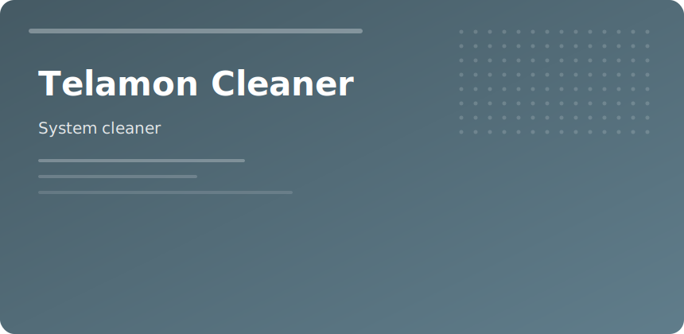

  

  

# Telamon Cleaner

Focused Windows housekeeping when disks fill with **temp caches**, **update leftovers**, and **stale startup entries**.

## Scan categories

- User temp / Windows temp
- Browser caches (optional)
- Log rot
- Invalid uninstall registry keys
- Startup manager

## Schedule

| Frequency | Task |
|-----------|------|
| Weekly | Temp + cache |
| Monthly | Startup audit |
| Quarterly | Deep registry (with backup) |

Not a replacement for uninstallers on broken apps—pair with dedicated removal tools when vendors leave services behind.

telamon cleaner windows cleanup registry privacy maintenance
